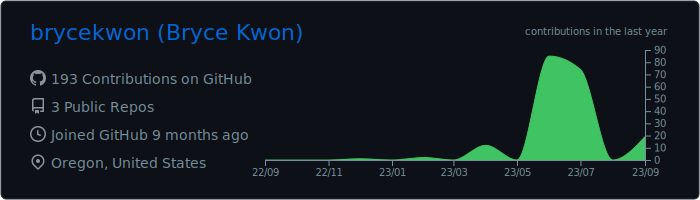
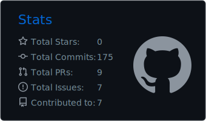
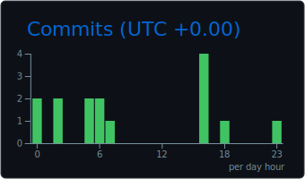
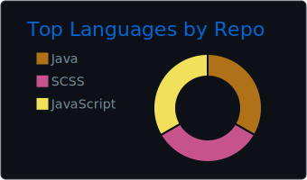
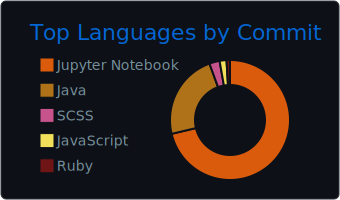

<h1 align="center">Hello There! I'm Bryce 👋</h1>

    I'm a student studying computer science at the University of Portland! Coding is a great interest of mine, as it allows me to create and do things that I could once only imagine.
    I care a lot about privacy and security and am an avid enjoyer of open-source projects. When I'm not at my keyboard, you can find me playing games, hiking, or hanging out with family and friends.

    
    
    
    
    

